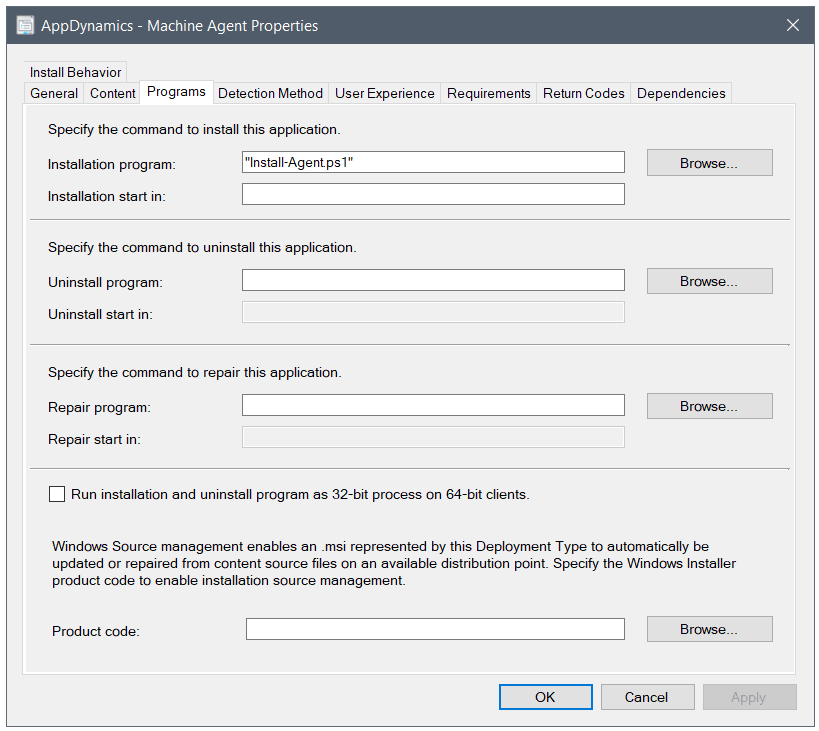
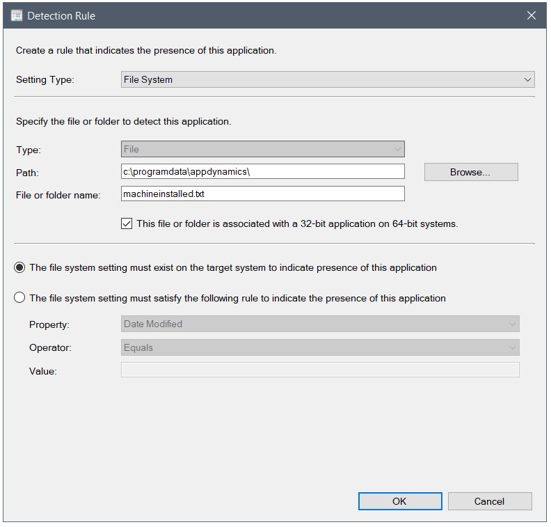
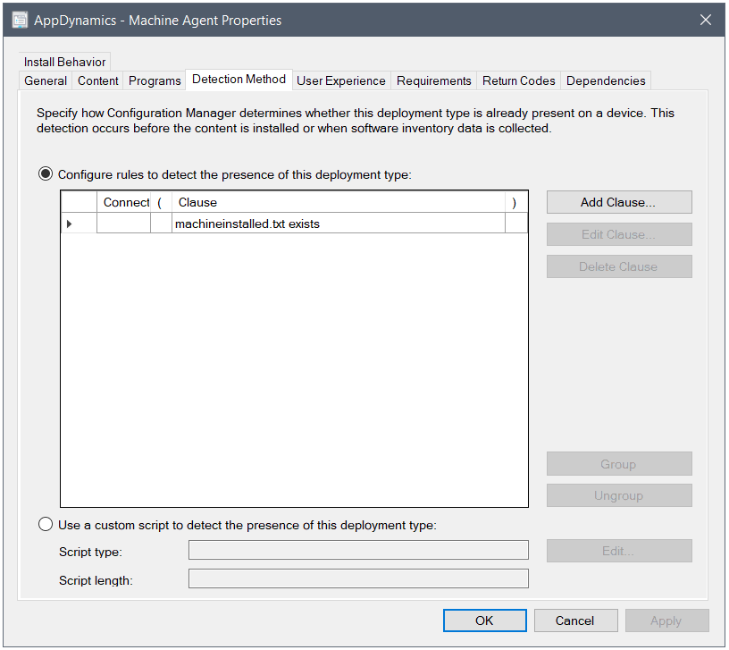
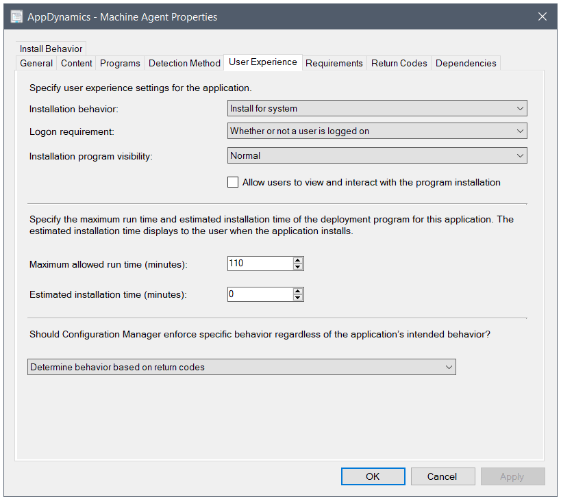

There are three main steps here
* Install-Agent.ps1
* InstallService-SCCM.vbs
* UninstallService-SCCM.vbs

# SCCM Configuration

The key parts of the package are
* Programs
  
* The detection method 
  
  
* User Experience
  

